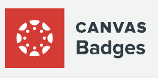

# Digital Badges with Badgr Sharing Instructions 

## Why Badgr Backpack? 

[BADGR Canvas Badge Backpack](https://badgr.com/auth/login){:target="_blank"} BADGR Canvas badge allows for organization of digital badges and easy sharing of your portfolio. 

[Example of Badge Backpack](https://badgr.com/backpack/badges).The goal of this tool is to collect, organize and share the digital badges you’ve earned.

## Learning objectives 

At the end of this workshop, you will be able to:

1. Create a badge collection / backpack
2. Create a URL link to your badges
3. Share your badges with others through social media,links, resume etc
 
[NEXT STEP: Pre-Workshop Activities](pre-workshop.html){: .btn .btn-blue }
